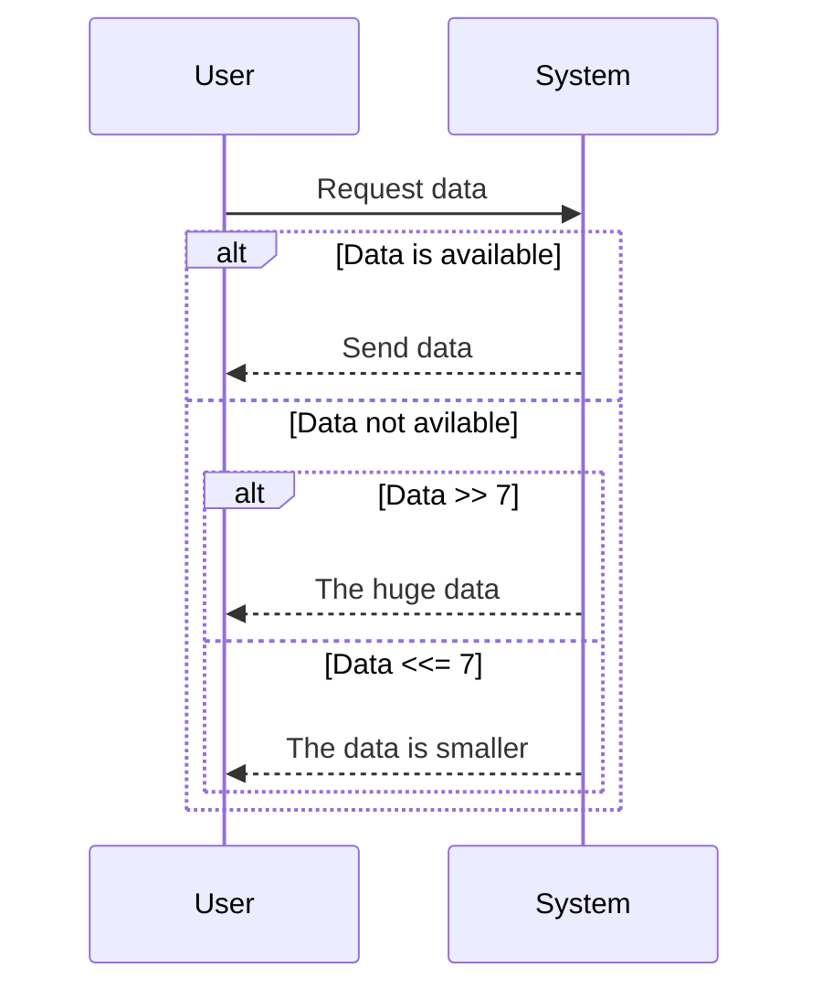

```mermaid
    sequenceDiagram
    participant A as User
    participant B as System
    A ->> B: Request data
    alt Data is available
        B-->>A: Send data
    else Data not avilable
        alt Data >> 7
           B -->>A: The huge data
        else Data <<= 7 
           B -->>A: The data is smaller
        end
    end

```
